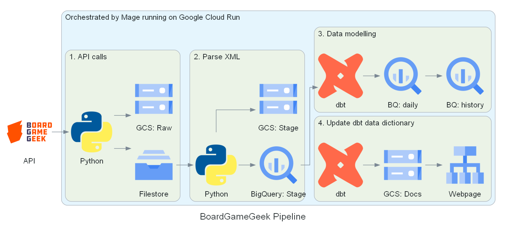
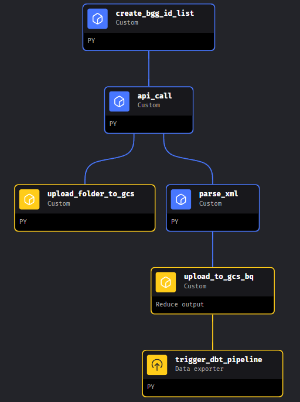
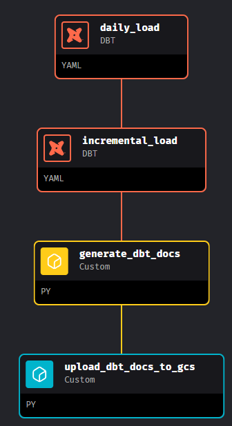
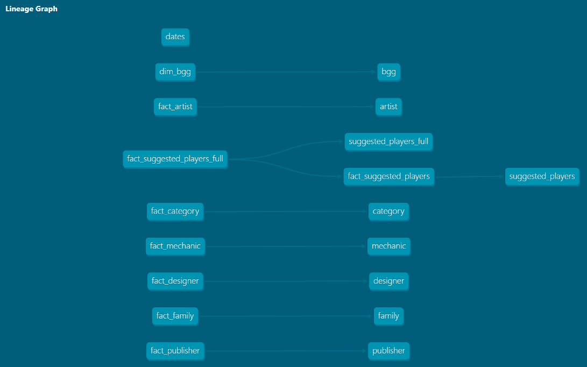
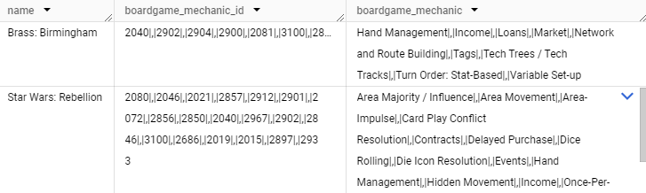
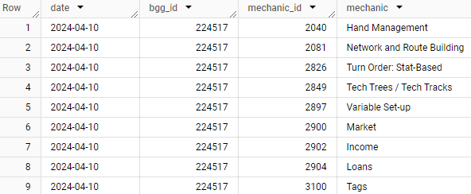
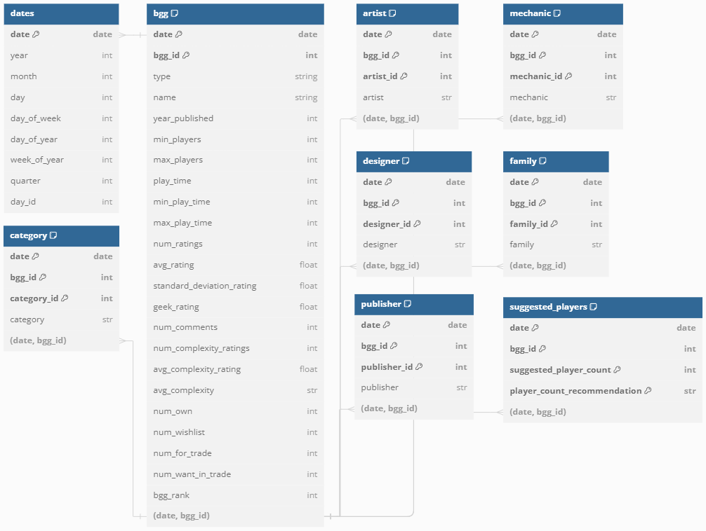
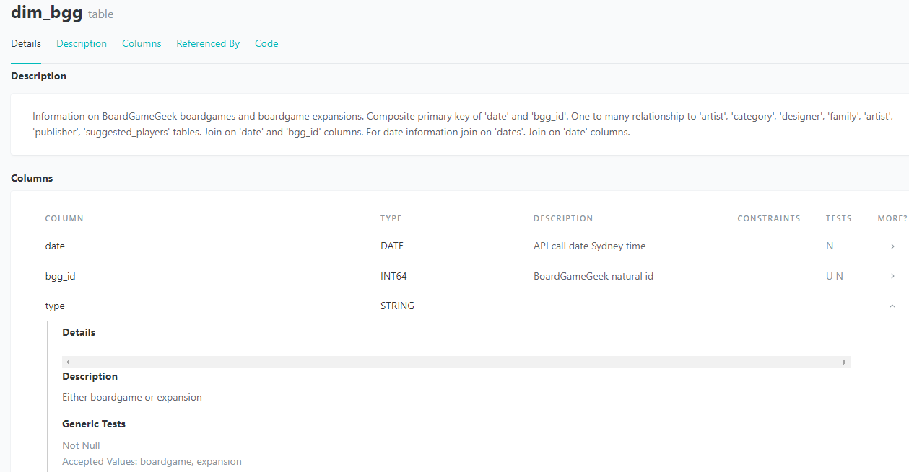
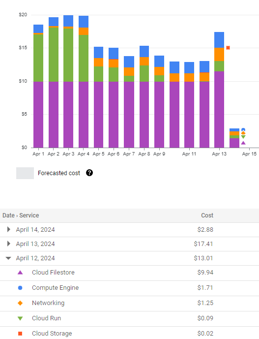

# BoardGameGeek Pipeline

### What is BoardGameGeek?
[​BoardGameGeek](https://boardgamegeek.com/) (BGG) is a popular online forum for board game hobbyists and a database of 121k board games and 33k expansions. BGG's database serves as one of the most comprehensive and current board game datasets, allowing for interesting analysis on board gaming trends and user preferences. 


### Links

- [**Design Decisions**](#Design-Decisions) - Detailed explanation of choice of methodology, infrastructure and tools
- [Set up instructions](terraform/setup.md) - Instructions to run the pipeline yourself
- [dbt docs](https://alfredzou.github.io/#!/overview) - dbt documentation
- [BoardGameGeek Analysis](https://lookerstudio.google.com/s/s2s628UzcQk) - Analysis performed on collected data

### Pipeline Introduction

This pipeline extracts [BGG's XML API2](https://boardgamegeek.com/wiki/page/BGG_XML_API2) data, parses the XML files and saves the denormalised data into a BigQuery staging schema. Data is modelled into a star schema using dbt and saved into a daily table in the production schema. This data is then incrementally loaded into respective historical tables in the production schema.



### Infrastructure Introduction

Google Cloud Platform is being used as the cloud provider. All infrastructure is set up is through terraform files. Minimal configuration of terraform variables files are required for project id and bucket names. [Set up instructions](terraform/setup.md)

- The main infrastructure setup is Cloud Run running Mage containers with 2 vCPUs and 4 GBs of memory. Filestore volumes are mounted to Mage to provide a local filesystem. The service account keys, stored in Secret Manager, are also mounted to Filestore for Mage's access. 

- A data bucket is used for storing raw and staged data. BigQuery is used as an OLAP database.

- The document bucket holds the dbt data dictionary, which is accessible through the load balancer. [dbt docs](https://alfredzou.github.io/#!/overview)


### Tools & Technologies
- **Infrastructure as code**: Terraform
- **Orchestrator**: Mage
- **Cloud storage**: Google Cloud Storage
- **Cloud database**: BigQuery
- **Cloud compute**: Cloud Run
- **Transformations**: dbt
- **Language**: Python
- **Dashboard**: Looker

# Design Decisions

In this postmortem, I reflect on the decisions made regarding the pipeline and infrastructure, highlighting what worked well, what didn't go as planned, and any unexpected challenges encountered along the way.

## Contents
- [Pipeline Design Explanation](#Pipeline-Design-Explanation)
- [Infrastructure, Tools & Technologies Design Explanation](#Infrastructure,-Tools-&-Technologies-Design-Explanation)

## Pipeline Design Explanation

The process is broken up into 4 steps:
1. Make ~170 API calls to retrieve and save the XML data locally. The XML data is then uploaded to the 'Raw' folder in a Google Cloud Storage (GCS) bucket.
2. The XML data is parsed for relevant fields. Parsed data is loaded to BigQuery 'Stage' schema, and parquet files are uploaded to the 'Stage' folder in a GCS bucket. 
3. Stage data is normalised and modelled into a Star Schema. This data is loaded in the 'Production' schema. After the daily load is complete, this is incrementally loaded into the relevant history tables in the 'Production' schema.
4. The dbt documentation is generated and uploaded to the documents bucket. This is viewable through a url provided by the http load balancer.


### Design Decisions
- [Minimise API calls](#minimise-API-calls)
- [API call reliability: retrying, error handling, logging, failing loudly and testing](#APIcall)
- [Idempotence](#Idempotence)
- [Chunking](#Chunking)
- [Separation of extraction and transformation](#Separation-of-extraction-and-transformation)
- [Daily staging tables](#Daily-staging-tables)
- [Star schema](#Star-schema)
- [Automating testing and documentation with dbt](#Automating-testing-and-documentation-with-dbt)
- [No partitioning and clustering](#No-partitioning-and-clustering)

### Minimise API calls

API calls are a significant speed bottleneck for the pipeline. Efforts have been made to minimise the number of API calls, whilst providing a 10 second wait time to reduce the impact on the public API. 
- Currently the natural id goes up to ~420k, which would mean 420k API calls
- The first optimisation was querying multiple ids per API call. From testing, 900 ids per call would reliably not trigger the 414 error of URI is too long. This brings the number of API calls down to ~460
- The next optimisating was downloading the daily id list. There are gaps in the natural ids, cutting the number of ids to be searched to ~150k. This further reduces the number of API calls to ~170

This pipeline currently takes about 2 hours to run, with ~170 API calls taking around 1 hour and 40 minutes.

### API call reliability: retrying, error handling, logging, failing loudly and testing <a id="APIcall"></a>

Given that the API call process takes so long, it's important to make sure the process is fault tolerant.
- The first method, is retrying 5 more times if the API call request returns 429 (Too many requests), 502 (Bad gateway) or 503 (Service Unavailable). Successive retry attempts are made after a 1, 2, 4, 8 and 16 second delay.
``` python
with requests.Session() as s:
    retries = Retry(total=5, backoff_factor=2, 
            status_forcelist=[429, 502, 503], allowed_methods=["GET"])
    s.mount('https://', HTTPAdapter(max_retries=retries))
```
- The second method, involves the Try Except Raise pattern. In the try method, it attempts to make an API call. If this fails the Except block will log and re-raise the error. Logging gives visibility on why the API call failed for debugging, whilst re-raising the error allows the pipeline to fail loudly. Failing loudly is important, to prevent erroneous data being served to stakeholders.
- Additionally, the Except block allows handling of specific errors such as Chunked Encoding Error. This error occurs when receiving improperly formatted chunked data from a http request. When a Chunked Encoding Error occurs, the code below will retry up to 3 times with a 10 second delay.
``` python
max_chunking_retries = 3
api_wait = 10

for retry_count in range(1, max_chunking_retries+1):
    try:
        r = s.get(url, params=params)
        r.raise_for_status()
        
        with open(raw_file_path, 'wb') as f:
            for row in r:
                f.write(row) 
        break
    except ChunkedEncodingError as e:
        logging.warning(f"An error occurred with api call {i}", exc_info=True)
        if retry_count <= max_chunking_retries:
            logging.warning(f"Retrying API call {i} after {api_wait} seconds...")
            sleep(api_wait)
        else:
            logging.error(f"Maximum retry attempts reached for API call {i}", 
            exc_info=True)
            raise
    except Exception as e:
        logging.error(f"An error occurred with api call {i}", exc_info=True)
        raise
```
- Unfortunately due to project scope, I wasn't able to write tests to improve the reliability of API call code. Especially since API calls are so variable, I would of used mocking to test handling of edge cases. Furthermore, CI/CD could of been set up using github actions to automatically test new code when it is pushed to the repository.

### Idempotence

When an error occurs with a pipeline run, we want to be able to recover from partial executions. Idempotence is the property of an operation where running it multiple times will have the same effect of running it once.
- One example of this is using a delete create pattern. The below code involves deleting folders created and recreating them.
``` python
def recreate_folders(path: str) -> None:
    if os.path.exists(path):
        shutil.rmtree(path)
    os.makedirs(path)
    return None
```
- Another example of this is using a replace file pattern. Most of the code to upload to GCS or BigQuery will overwrite existing files. Although, this method isn't as full proof as the delete create pattern.
- One key pipeline process is incrementing the daily data into respective history tables in the 'production' schema. To avoid data duplication and ensure idempotence, the data is incrementally loaded based on unique key. If that unique key already exists in the history table, that row of data will not be inserted.
``` sql
{{
    config(
        materialized='incremental',
        unique_key=['date','bgg_id'],
        incremental_strategy="merge",
        on_schema_change='fail'
    )
}}
```

### Chunking

Since cloud computing is often continuously run for scheduling of pipeline jobs, it's important to make sure the code is memory efficient to reduce costs. To achieve this, chunking is used consistently to reduce memory usage.

Pandas is notoriously known for not being memory efficient, so it would be interesting to see if packages like Polars, Dask, Modin and DuckDB will be better suited.

### Separation of extraction and transformation

A key idea of this pipeline is the separation of extraction and transformation processes into two separate pipelines. In retrospect, I would move the XML parsing into the transformation pipeline.
- The extraction pipeline would extract the API data. This pipeline reflects the data as of run date. This pipeline would then save the raw XML data to a GCS bucket.
- The transformation pipeline would take this raw XML data, parse it, stage it in BigQuery and model it using dbt. 
- Currently the extraction pipeline runs daily and triggers the transformation pipeline. The transformation pipeline is kept separate incase a backfill is required due to changing business requirements. This setup follows a ELT framework. Since storage is cheap, it's a good idea to keep the raw files around.

Extraction Pipeline             |  Transformation Pipeline
:------------------------------:|:-------------------------:
  |  

### Daily staging tables

I decided to load the staging table separately in the format of `bgg-YYYY-MM-DD` and `sp-YYYY-MM-DD`. This is to provide resilience to upstream changes in the form of a change in source data or change in business rules to parse the XML data. Unfortunately, it doesn't seem that the yml configuration file for dbt is able to handle this dynamic naming style. The consequence of this is that the dbt lineage does not identify the sources.

**Data Lineage**



### Star schema

Unlike traditional tabular formats, XML offers a hierarchical and flexible way to represent data, allowing for nested structures. The parsed XML data below in the staging schema, represents denormalised data. From an analytical perspective this data is extremely difficult to work with and filter on.

**Nested mechanics column from staging schema**



To make this data easier to work with, below code is used to create a new mechanics table with the data unnested. This is repeated multiple times for other nested data, such as 'family', 'category', 'artist', 'designer' and 'publisher' tables.
``` sql

{% set dt_local = dt.astimezone(modules.pytz.timezone('Australia/Sydney')).strftime("%Y-%m-%d") %}

SELECT DISTINCT
  CAST(date as DATE) AS date,
  bgg_id,
  CAST(mechanic_id AS INT) AS mechanic_id,
  mechanic,
FROM `{{ env_var('GCP_PROJECT_ID') }}.bgg_stage.bgg-{{ dt_local }}`,
  UNNEST(SPLIT(boardgame_mechanic_id,'|,|')) AS mechanic_id WITH OFFSET b,
  UNNEST(SPLIT(boardgame_mechanic,'|,|')) AS mechanic WITH OFFSET c
WHERE b = c
AND mechanic NOT IN ('<NA>') AND mechanic_id NOT IN ('<NA>')
```

**Mechanics table in production schema**



This results in the below entity relationship diagram in a star schema format. `bgg` represents the central fact table holding all the metrics, surrounded by all the dimension tables. The tables are joined together through `date` and `bgg_id`, although a possible improvement could be adding a hash on the columns for easier joining.

The dimension tables violate 2nd normal form. For the mechanics table, 'mechanic' is dependent on '(date, mechanic_id) and not the full primary key. I've chosen not to further normalise the data, as it would increase the number of joins and tables, making analytics more challenging.

**Entity relationship diagram**



Although due to different granularity and the one-to-many relationships, users need to be careful about data duplication on joins. Perhaps one way to combine this data is through creating flags, for example comparing crowdfunding games to the general population.

``` sql
SELECT 
date,
year_published,
bgg_id, 
avg_complexity_rating, 
avg_rating,
type,
(CASE WHEN bgg_id IN (
    SELECT bgg_id FROM `bgg_prod.family` 
    WHERE family LIKE 'Crowdfunding%') 
    AND date IN (SELECT MAX(date) FROM bgg_prod.bgg) 
    THEN 1 ELSE 0 END) AS crowdfunding_flag,
FROM bgg_prod.bgg
WHERE 1=1
AND date IN (SELECT MAX(date) FROM bgg_prod.bgg)
```

### Automating testing and documentation with dbt

dbt's schema.yml file serves as an easy way to both test and document sql transformations in one place. Tests have been written to ensure the reliability of source data and transformations made. Documentation is important, as it allows end users to better and more quickly understand the data and underlying business logic. This documentation is then easily accessible through a website: [dbt docs](https://alfredzou.github.io/#!/overview)

**schema.yml**
``` yml
models:
  - name: dim_bgg
    description: >
          Information on BoardGameGeek boardgames and boardgame expansions. 
          Composite primary key of 'date' and 'bgg_id'.

          One to many relationship to 'artist', 'category', 'designer', 'family', artist', 'publisher', 'suggested_players' tables. Join on 'date' and 'bgg_id' columns.

          For date information join on 'dates'. Join on 'date' columns.
    tests:
      - dbt_utils.unique_combination_of_columns:
          combination_of_columns:
            - date
            - bgg_id

    columns:
      - name: date
        data_type: date
        description: "API call date Sydney time"
        tests:
          - not_null
```

To make the documentation automated, the documentation is generated every pipeline run and uploaded to a document GCS bucket. This is then served to the public using a http load balancer url, ensuring documentation freshness.

**Resulting documentation**


**Data transparency through seeing transformation code**


### No partitioning and clustering

Due to the small daily data size of ~150,000 rows, partitioning and clustering of the history table was not used. It's likely that partitioning and clustering a small dataset will actually reduce the query speed with excess metadata.

## Infrastructure, Tools & Technologies Design Explanation

### Infrastructure


### Tools & Technologies
- **Infrastructure as code**: Terraform
- **Orchestrator**: Mage
- **Cloud storage**: Google Cloud Storage
- **Cloud database**: BigQuery
- **Cloud compute**: Cloud Run
- **Transformations**: dbt
- **Language**: Python
- **Dashboard**: Looker

### Design Decisions
- [Infrastructure as code vs manual setup](#Infrastructure-as-code-vs-manual-setup)
- [Orchestrator vs cron vs no orchestrator](#Orchestrator-vs-cron-vs-no-orchestrator)
- [Cloud compute - Cloud Run vs Virtual Machine](#Cloud-compute---Cloud-Run-vs-Virtual-Machine)
- [Cloud database - OLAP vs OLTP](#Cloud-database---OLAP-vs-OLTP)
- [Transformations - dbt vs PySpark](#Transformations---dbt-vs-PySpark)

### Infrastructure as code vs manual setup

To set up my cloud infrastructure, I use infrastructure as code to define my infrastructure configurations. This is an automated and consistent approach compared to manual set up. This is much preferred over the manual approach, as set up will be a lot easier. 

Despite this, in retrospect there is still a considerable amount of set up and improvements can be made. Although most of it comes from setting up service account permissions. [Set up instructions.](terraform/setup.md) The current terraform set up is functionally split: the buckets, Mage and load balancer for hosting dbt docs. However, there are 3 separate 'variables.tf' files that take similar information as project name, data bucket name and document bucket name. Redundancy can be reduced by using a common variables.tf file, in a a structure like below.

```shell
BoardGameGeek_Pipeline/
├── terraform/
│   ├── variables.tf      
│   ├── 1.gcs/
│   │   ├── main.tf  
│   ├── 2.mage/
│   │   ├── main.tf 
│   ├── 3.dbt_docs/
│   │   ├── main.tf
```

Additionally there is some manual enabling of APIs, which should be do able through terraform. There is also a part of the terraform file that creates a Compute Engine default service account, but does not have the permissions to access files in secret manager. I think the best practice is to either specify an existing service account, or though terraform provision the 'Secret Manager Secret Accessor' role to it.

### Orchestrator vs cron vs no orchestrator

In this project I used a pipeline orchestrator, as it allows complex workflows to be executed in the correct order based on their dependencies. Additionally they offer visibility to developers through monitoring and logging to track pipeline execution.
- The alternative would to use cron, a time-based scheduler. However cron is suited for simple recurring tasks and lacks dependency management. It also provides minimal monitoring and logging capabilities.
- The least desirable approach would involve manually running the pipeline one process at a time.

### Cloud compute - Cloud Run vs Virtual Machine

There were two options for deploying Mage.
- A cheaper setup would be deploying Mage on a virtual machine. The cost would roughly be $30 per month for 2 vCPU and 4 GBs of memory and another $10 per month for 100 GBs of storage. The downside of this would require more management overhead.
- As I was trying to simulate a more professional environment, I decided to deploy Mage using Cloud Run connected to Filestore, a managed filesystem. This is an expensive option, see below. Filestore's minimum size is 1Tb and costs $10 per day, whilst running Cloud Run daily can cost $8 per day for a 2 vCPU and 4 GBs of memory. The biggest benefit of using serverless compute is reducing the management overhead and providing the ability to easily scale horizontally by creating new containers.

**Cost breakdown from using Cloud Run and Filestore**



### Cloud database - OLAP vs OLTP

An OLAP database was chosen over an OLTP database, as the resulting data is being used for analytical use. An OLAP database is more efficient for analytics, as the data is columnar stored. Performing an aggregation, would not require scanning the entire table. BigQuery was chosen as it is GCP's OLAP database.

### Transformations - dbt vs PySpark

Since the dataset was small, there was no need to use the parallel processing of PySpark. Additionally there would of been a lot of additional infrastructure overhead of setting up a spark cluster using Dataproc, Google's managed Spark cluster.

I choose to use dbt because:
- it's easy to write tests
- leverages the compute of a database
- provides more data visibility through data dictionary and lineage
- PySpark not required

## Opportunities for Further Development
- Add testing and mocking for API call and parse XML code
- Move parse XML code from extraction pipeline into transformation pipeline
- Easier and less manual terraform set up
- Common variables file for terraform set up
- Correctly label dimension and fact tables. Currently dimension tables are labeled as fact tables and vice versa
- Use pandas alternatives, such as polars, to reduce memory usage
- Use generators instead of chunking to further reduce memory usage
- Add CI/CD through github actions on pushing to github
- Add backfill functionality to transformation pipeline