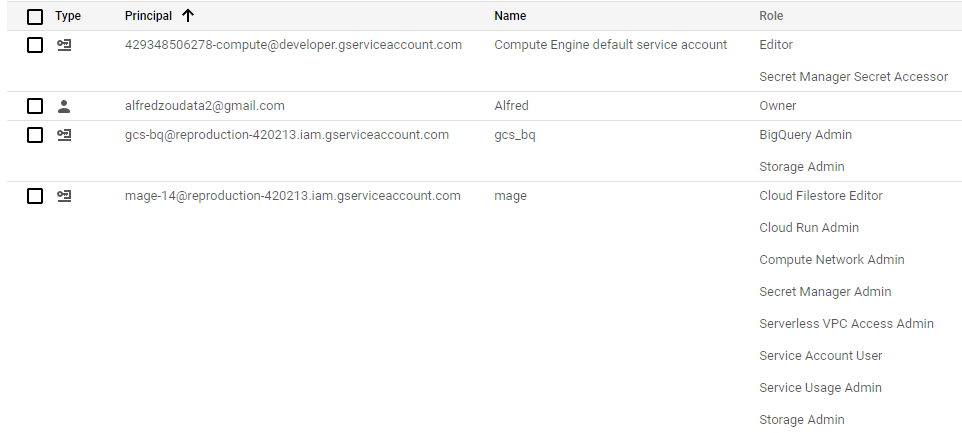
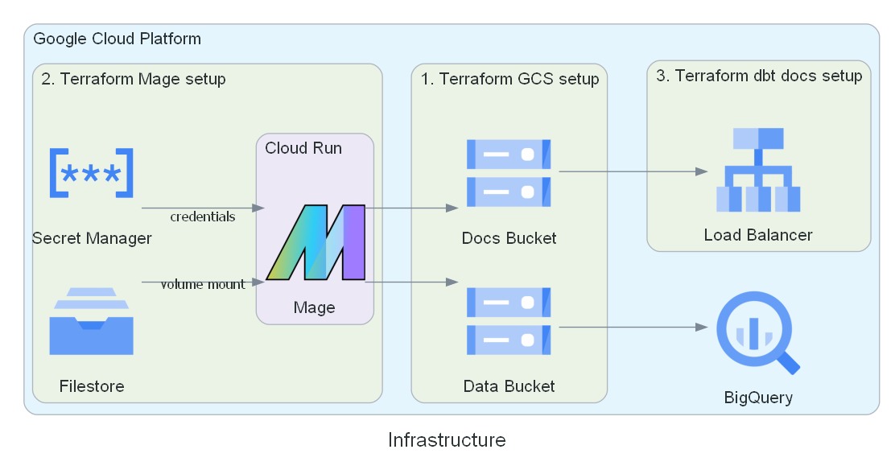

<style>
r { color: #CB0C3A }
</style>

# Setup

### Requirements
1. Terraform installed
2. Google Cloud Platform account

### Instructions
#### Google Cloud Platform Steps - Setting up permissions
1. Create new project
2. Navigate to the 'Service Accounts' page (under 'IAM & Admin')
3. Create a service account called **gcs_bq** and assign it these roles:
    - **BigQuery Admin**
    - **Storage Admin**
4. Open this service account and navigate to the 'KEYS' tab
5. Click 'ADD KEY', 'Create new key', 'JSON' and 'CREATE'
6. Rename the key to **gcs_bq.json** and move it to '~/.gcp/gcs_bq.json'
7. Create a service account called **mage** and assign it these roles: 
    - **Cloud Filestore Editor**
    - **Cloud Run Admin**
    - **Compute Network Admin**
    - **Secret Manager Admin**
    - **Serverless VPC Access Admin**
    - **Service Account User**
    - **Service Usage Admin**
    - **Storage Admin**
8. Open this service account and navigate to the 'KEYS' tab
9. Click 'ADD KEY', 'Create new key', 'JSON' and 'CREATE'
10. Rename the key to **mage.json** and move it to '~/.gcp/mage.json'
11. Navigate to 'APIs & Services' and enable these APIs:
    - Cloud Resource Manager API
    - Identity and Access Management (IAM) API	
    - Serverless VPC Access API
    - Service Usage API

#### The access for **gcs_bq** and **mage** should match below


#### Terraform Steps - Setting up Infrastructure
1. Clone the repository
``` terminal
git clone https://github.com/alfredzou/BoardGameGeek_Pipeline.git
```
2. Update the 3 **variables.tf** files in the terraform folder. The variables that need to be changed are 'project_id', 'gcs_bucket_name' and 'dbt_gcs_bucket_name'. Noting that bucket names must be globally unique.
3. For **1.gcs subdirectory**, run:

``` terminal
terraform init
terraform apply
```
4. For **2.mage subdirectory**, run 'terraform init' and 'terraform apply'. <r>**This will fail as the Compute Engine default service account does not have access to the Secret Manager. Run steps 5 to 7 to fix this.**</r>
5. Navigate to the 'IAM' page (under 'IAM & Admin')
6. Click 'Edit principal' for Compute Engine default service account and assign it the **Secret Manager Secret Accessor**
7. Rerun 'terraform apply'
8. For **3.dbt_docs subdirectory**, run 'terraform init' and 'terraform apply'



#### Mage Steps - Running the pipeline
1. Navigate to Cloud Run page
2. Open 'mage' and open the URL
3. Navigate to 'Terminal' using the side pane
4. Run these commands
``` terminal
rm -rf /home/src/default_repo
git clone https://github.com/alfredzou/BoardGameGeek_Pipeline.git /home/src/default_repo
```
5. Run these commands
``` terminal
cd /home/src/default_repo/dbt/bgg
dbt deps
```
6. Navigate to 'Pipelines' using the side pane and click 'boardgamegeek_pipeline'
7. Click 'Run@once' and 'Run now' (the pipeline run can also be scheduled). Noting the pipeline will take around 2 hours to run due to the API calls. <r>**The pipeline is written based on Sydney Australia time, it must be completely run within the same day**</r>

#### View dbt docs
1. Navigate to 'Load balancing' page (under 'Network services')
2. Click 'dbt-docs-http-lb'
3. Copy and paste the value of 'IP:Port' into the browser

#### Clean up
1. Go to each terraform subdirectory** and run 'terraform destroy'
2. The buckets have force_destroy = False, so they need to be manually deleted
3. Manually delete the datasets from BigQuery